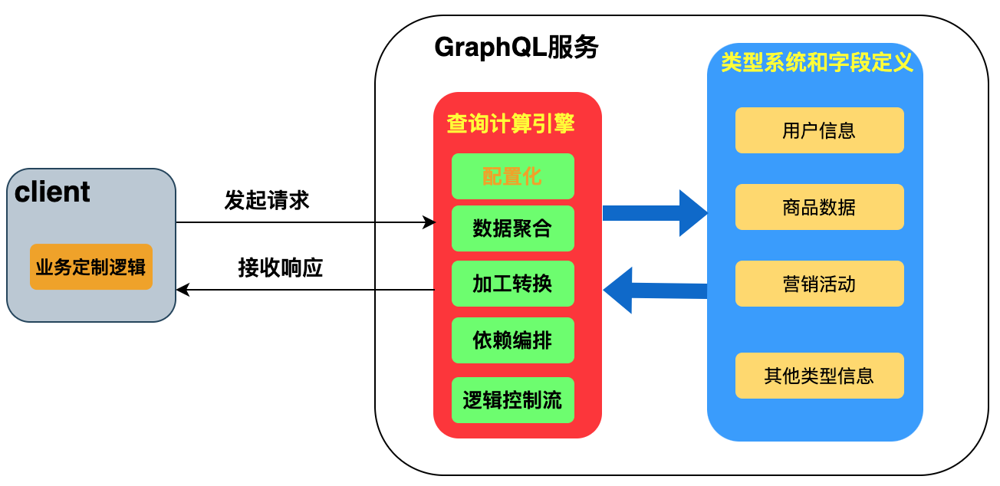

# graphql-calculator


[](https://maven-badges.herokuapp.com/maven-central/com.graphql-java-calculator/graphql-java-calculator)

[📖 English Documentation](README_EN.md) | 📖 中文文档 | [介绍ppt](static/Introduction%20to%20GraphQl%20Calculator.pptx) | [**🏆相关奖项🏆**](static/awards_ks.jpg)

----------------------------------------

`GraphQL Calculator`是一款轻量级**查询计算引擎**，为`graphql`查询提供了动态计算的能力。

该组件旨在通过[指令](https://spec.graphql.org/draft/#sec-Language.Directives)和表达式系统，
通过简单的配置在`graphql`查询中实现常规的加工转换、数据编排和控制流的能力，让客户端从繁杂地基础数据加工处理和编排中解放出来。




# 特性

`GraphQL Calculator`计算指令的名称和语义参考[`java.util.stream.Stream`](https://docs.oracle.com/javase/8/docs/api/java/util/stream/Stream.html)，易于理解和使用。
计算指令的目的是增强graphql查询的表意能力，因此指令表达式只可使用常量字符串，不可使用查询变量，因为变量将使得查询的语义和合法性变得不明确。

- 字段加工：通过表达式对结果字段进行加工处理，可通过多个字段计算出一个字段；
- 列表处理：通过列表指令可便捷的对结果中的列表字段进行过滤、排序、去重；
- 参数转换：对请求参数进行转换，包括参数整体转换、列表类型参数过滤、列表类型参数的元素转换；
- 控制流：提供了`@skip`和`@include`拓展版本，通过表达式判断是否解析注解的字段；
- 数据编排：将指定字段的获取结果作为全局可获取的上下文，为获取其他字段提供可依赖数据，该能力可用于字段加工、列表处理和参数转换中。


# 快速开始

#### 1. 引入依赖

最新版本见[Mvn Repository](https://mvnrepository.com/artifact/com.graphql-java-calculator/graphql-java-calculator)。
```
<dependency>
    <groupId>com.graphql-java-calculator</groupId>
    <artifactId>graphql-java-calculator</artifactId>
    <version>${version}</version>
</dependency>
```

#### 2. 包装执行引擎

##### 2.1 创建`GraphQLSource`

通过`DefaultGraphQLSourceBuilder`创建`GraphQLSource`对象，该对象包含`GraphQLSchema`和执行引擎`GraphQL`。
可使用配置类`Config`指定表达式引擎，默认表达式引擎为[`aviatorscript`](https://github.com/killme2008/aviatorscript)。

##### 2.2 执行前校验

通过`Validator`对使用了计算指令的查询进行校验，该校验包含graphql原生语法校验，
建议实现`CalculatorDocumentCachedProvider`缓存校验结果。

完整示例参考[`Example`](/src/test/java/calculator/example/Example.java)

**注意**：
如果项目中使用了自定义的异步`DataFetcher`，则使其则继承`AsyncDataFetcherInterface`、并在接口方法实现中返回被包装的`DataFetcher`和使用的线程池。
如果使用的是`graphql-java`的`graphql.schema.AsyncDataFetcher`则可忽略该操作。


# 指令说明

#### **@fetchSource**

`directive @fetchSource(name: String!, sourceConvert:String) on FIELD`

参数解释：
- name：source的名称，一个查询语句中source名称是唯一的；
- sourceConvert：对source原始结果进行转换的表达式，所有依赖该source的指令获取的都是转换后的数据。

@fetchSource是进行数据编排的基础，该指令注解字段的DataFetcher的请求结果可作为**全局可获取上下文**、在其他计算指令上通过`dependencySources`获取。

如果@fetchSource所注解的字段在列表路径中，则将该字段的集合将作为source的值。如下查询source类型为List<String>，元素值为用户的名称。

```graphql
query fetchSourceDemo($userIds: [Int]){
    consumer{
        userInfoList(userIds: $userIds){
            userId
            name @fetchSource(name: "nameList")
        }
    }
    # ... do some thing
}
```

#### **@skipBy**

`directive @skipBy(predicate: String!) on FIELD | INLINE_FRAGMENT | FRAGMENT_SPREAD`

参数解释：
- predicate：判断是否跳过解析该字段的表达式，表达式参数为查询变量；

@skipBy是graphql内置指令@skip的扩展版本，可通过表达式判断是否请求该字段。
同@skip一样，@skipBy也可定义在片断上，如果predicate计算结果不为bool类型或抛异常，则查询将抛异常，且不会真正执行每个字段的请求、解析。

#### **@includeBy**

`directive @includeBy(predicate: String!) on FIELD | INLINE_FRAGMENT | FRAGMENT_SPREAD`

参数解释：
- predicate：判断是否解析该字段的表达式，表达式参数为查询变量；

@includeBy是graphql内置指令`@include`的扩展版本，可通过表达式判断是否请求该字段。
同@include一样，@includeBy也可定义在片断上，如果predicate计算结果不为bool类型或抛异常，则查询将抛异常，且不会真正执行每个字段的请求、解析。

#### **@map**

`directive @map(mapper:String!, dependencySources:String) on FIELD`

参数解释：
- expression：计算字段值的表达式；
- dependencySources：表达式依赖的source，sourceName如果和父节点绑定DataFetcher的获取结果key相同，则计算表达式时会覆父节点中的数据。

以父节点绑定的DataFetcher获取结果和`dependencySources`为参数，计算注解的字段的值。被注解字段绑定的DataFetcher不会在执行。

#### **@argumentTransform**

`directive @argumentTransform(argumentName:String!, operateType:ParamTransformType, expression:String, dependencySources:String) on FIELD`
```graphql
enum ParamTransformType{
    MAP
    FILTER
    LIST_MAP
}
```

参数解释：
- argumentName：要被转换处理的的参数的名称；
- operateType：操作类型，包括参数整体转换MAP、列表参数过滤FILTER、列表参数元素转换LIST_MAP，默认为MAP；
- expression：操作表达式，参数为请求变量和source，如果存在同名key则source覆盖请求变量；
- dependencySources：表达式依赖的source。

对字段参数进行转换、过滤，具体操作有如下三种：
1. 参数映射(`operateType = Map `)：将表达式结果赋给指定的字段参数，该操作将字段上的所有变量作为表达式参数；
2. 列表参数过滤(`operateType = FILTER`)：过滤列表类型参数中的元素，该操作将字段上的所有变量和<"ele",元素值>作为表达式参数；
3. 列表参数映射(`operateType = LIST_MAP`)：使用表达式对列表参数中的每个元素进行转换，该操作将字段上的所有变量和<"ele",元素值>作为表达式参数。

若依赖全局可获取上下文，则表达式变量中会加上一个key为source名称、值为source的键值对。

#### **@filter**

`directive @filter(predicate: String!) on FIELD`

参数解释：
- predicate：过滤判断表达式，结果为true的元素会被保留；

对列表进行过滤，参数为查询解析结果：当列表元素为对象类型时、表达式变量为对象对应的`Map`，当元素为基本类型时、表达式变量为key为`ele`、value为元素值。


#### **@distinct**

`directive @distinct(comparator:String) on FIELD`

参数解释：
- comparator：使用该表达式计算元素的唯一key，唯一key相同的元素会被去重，对于有序列表保留第一个元素。
comparator为可选参数，当未设置该参数时使用`System.identityHashCode(object)`判断元素是否为相同对象。

对列表元素进行去重，当元素为基本类型时、表达式变量为key为`ele`、value为元素值。


#### **@sortBy**

`directive @sortBy(comparator: String!, reversed: Boolean = false) on FIELD`

参数解释：
- comparator：按照该表达式计算结果、对列表进行排序；
- reversed：是否进行逆序排序，默认为false。

对列表进行排序，参数为查询解析结果：当列表元素为对象类型时、表达式变量为对象对应的`Map`，当元素为基本类型时、表达式变量为key为`ele`、value为元素值。
不管reversed是否为true，表达式结果为null的元素总是排在列表最后。
    
#### **@partition**

`directive @partition(size: Int!) on ARGUMENT_DEFINITION`

参数解释：
- size：将参数列表按照 size 进行分组调用。

将 @partition 注解的参数按照 size 等分成多组(最后一组个数可能小于 size)，分别去执行该字段的请求逻辑并合并结果。注解的参数为null时则使用原始参数去执行请求。分组的请求是否并行执行取决于原始字段请求逻辑是否是异步执行。


# 使用示例

以[测试schema](https://github.com/graphql-calculator/graphql-calculator/blob/refactorForSchedule/src/test/resources/schema.graphql)为例，
对计算指令实现数据编排、结果处理转换和控制流等的能力进行说明。


#### 数据编排

数据编排的主要形式为请求a字段时、其请求参数为b字段的结果，或者需要b字段结果对a字段请求参数进行过滤、转换处理。

- 获取商品信息，并通过商品列表中的sellerId获取卖家信息
```graphql
query sourceInList_case01($itemIds:[Int]){
    commodity{
        itemList(itemIds: $itemIds){
            # 保存商品的卖家id，结果为 List<Integer>
            sellerId @fetchSource(name: "sellerIdList")
            name
            saleAmount
            salePrice
        }
    }

    consumer{
        userInfoList(userIds: 1)
        @argumentTransform(argumentName: "userIds", # 对参数 userIds 进行转换
                            operateType: MAP, # 操作类型为参数整体转换
                            expression: "sellerIdList", # 表达式表示使用表达式变量 sellerIdList 对参数作整体替换
                            dependencySources: ["sellerIdList"] # 依赖了全局变量 sellerIdList
        ){
            userId
            name
            age
        }
    }
}
```

- 变量只有券id、查询该券绑定的商品详情。
```graphql
query getItemListBindingCouponIdAndFilterUnSaleItems ( $couponId: Int) {
    marketing{
        coupon(couponId: $couponId){
            # 获取券绑定的商品id，并注册为名称为 itemIdList 的source
            bindingItemIds @fetchSource(name: "itemIdList")
        }
    }

    commodity{
        itemList(itemIds: 1)
        # 对参数 itemIds 进行映射转换，映射规则为'itemIdList'、即直接使用变量 itemIdList 进行替换，该计算依赖了名称为 itemIdList 的source
        @argumentTransform(argumentName: "itemIds", operateType: MAP,expression: "itemIdList",dependencySources: "itemIdList")
        {
            itemId
            name
            salePrice
            onSale
            # sellerId
        }
    }
}
```

#### 参数转换

入参为`userId`，按照指定的格式拼接为 redis 的key。
```graphql
query userNewInfo($userId: Int){
    consumer{
        isNewUser(redisKey: "fashion:shoes:",userId: $userId)
        # 将参数拼接为 redis 的key，fashion:shoes:{userId}
        @argumentTransform(argumentName: "redisKey",operateType: MAP ,expression: "concat(redisKey,userId)")
        {
            userId
            isNewUser
            sceneKey
        }
    }
}
```

#### 参数过滤

- 请求商品信息前，过滤掉没有指定绑定券id的商品id，券绑定的商品id来自其他字段数据。
```graphql
query filterItemListByBindingCouponIdAndFilterUnSaleItems ( $couponId: Int,$itemIds: [Int]) {
    commodity{
        itemList(itemIds: $itemIds)
        @argumentTransform(argumentName: "itemIds", operateType: FILTER,dependencySources: "itemIdList",expression: "listContain(itemIdList,ele)")
        {
            itemId
            name
            salePrice
            onSale
        }
    }

    marketing{
        coupon(couponId: $couponId){
            bindingItemIds
            @fetchSource(name: "itemIdList")
        }
    }
}
```

#### 控制流

控制流主要为根据条件，判断是否请求某个类型数据、或者请求哪个类型数据。

控制流通过 **@skipBy**进行控制 `directive @skipBy(predicate: String!) on FIELD`。

通过 **@skipBy** 可实现类似 `switch-case`的控制流，
```
// @fetchSource
switch(value):
    // @skipBy(value,judgeFunction)
    case(judgeFunction_1(value)): opration_1;
    case(judgeFunction_2(value)): opration_2;
    case(judgeFunction_2(value)): opration_2;

``` 

```graphql
query skipBy_case01($userId:Int){
    consumer{
        userInfo(userId: $userId)
        # the userInfo field would not be queried if 'userId>100' is true
        @skipBy(predicate: "userId>100")
        {
            userId
            name
        }
    }
}
```

####  数据补全/动态计算

- 分别查找券信息和列表商品信息；
- 如果商品绑定了券则返回券后价和是否绑定的标识
- 对券数据拼接描述文案；
```graphql
query calculateCouponPrice_Case01 ($couponId: Int, $itemIds: [Int]){

    marketing{
        coupon(couponId: $couponId)
        @fetchSource(name: "itemCouponInfo",sourceConvert: "list2MapWithAssignedValue('coupon.bindingItemIds','coupon.price')")
        {
            base
            price
            bindingItemIds
            desc: couponText @map(mapper: "'满' + base + '减' + price")
        }
    }

    commodity{
        itemList(itemIds: $itemIds){
            itemId
            name
            salePrice
            isUsedCoupon: onSale @map(dependencySources: "itemCouponInfo",mapper: "seq.get(itemCouponInfo,itemId)!=nil")
            # 券后价
            couponPrice: salePrice @map(dependencySources: "itemCouponInfo",mapper: "salePrice - (seq.get(itemCouponInfo,itemId) == nil? 0:seq.get(itemCouponInfo,itemId)) ")
        }
    }
}
```

#### 列表排序

对列表字段进行排序。例如对商品进行排序：将可用券的商品放在列表前边。
1. 先通过 `@fetchSource`和`@map` 指令标识商品是否可用指定券；
2. 使用 `@sortBy`对列表进行排序；

```graphql
query sortByWithSource_case01{
    commodity{
        itemList(itemIds: [9,11,10,12])
        @sortBy(comparator: "!isContainBindingItemIds")
        {
            isContainBindingItemIds:onSale @map(mapper: "listContain(bindingItemIds,itemId)",dependencySources: "bindingItemIds")
            itemId
            name
            salePrice
        }
    }

    marketing{
        coupon(couponId: 1){
            bindingItemIds @fetchSource(name: "bindingItemIds")
        }
    }
}
```

#### 列表过滤

对列表进行过滤：只保留可用券的商品。
1. 先通过 `@fetchSource`和`@map` 指令标识商品是否可用指定券；
2. 使用 `@filter` 过滤出可使用券的商品。
```graphql
query filter_case01{

    # 查询可使用指定券的商品id
    marketing{
        coupon(couponId: 1){
            bindingItemIds @fetchSource(name: "bindingItemIds")
        }
    }

    commodity{
        itemList(itemIds: [9,11,10,12])
        # 通过 filter 过滤不可用券的商品
        @filter(predicate: "!isContainBindingItemIds")
        {
            # 通过 @map 命令标识该商品是否可使用券
            isContainBindingItemIds:onSale @map(mapper: "listContain(bindingItemIds,itemId)",dependencySources: "bindingItemIds")
            itemId
            name
            salePrice
        }
    }
}
```


#### 列表去重

根据年龄对用户列表进行去重，每个年龄只保留一个用户。
```graphql
query distinctUserInfoListByAge($userIds:[Int]){
    consumer{
        distinctUserInfoList: userInfoList(userIds: $userIds)
        # 未设置comparator则使用`System.identityHashCode(userInfo)`判断元素是否为相同对象进行去重
        @distinct(comparator: "age")
        {
            userId
            name
            age
            email
        }
    }
}
```
    
#### 分组调用

@Partition 是Schema指令，Schema 中使用 @partition 需预先定义。如下示例为请求userInfoList时，将参数按照每5个一组进行分批调用。
```graphql
directive @partition(size: Int!) on ARGUMENT_DEFINITION

type Query {
    # c端 用户
    userInfoList(userIds: [Int] @partition(size: 5)): [User]
}

type User{
    userId: Int
    age: Int
    name: String
    email: String
    clientVersion: String
}
```

# 交流反馈

欢迎在[issue](https://github.com/graphql-calculator/graphql-calculator/issues)区对组件问题或期待的新特性进行讨论，欢迎参与项目的建设。
